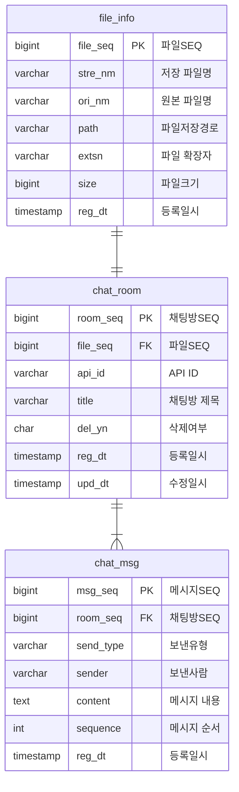

## 🗂️ DATABASE

<br>

### ⚡ ERD


<br>

### ⚡ TABLE SQL
```sql
-- DROP TABLE file_info
CREATE TABLE file_info (
  file_seq bigint(20) NOT NULL AUTO_INCREMENT COMMENT '파일SEQ',
  stre_nm varchar(200) NOT NULL COMMENT '저장파일명',
  ori_nm varchar(200) NOT NULL COMMENT '원본파일명',
  path varchar(300) NOT NULL COMMENT '파일저장경로',
  extsn varchar(5) DEFAULT NULL COMMENT '파일확장자',
  size bigint(20) DEFAULT NULL COMMENT '파일크기',
  reg_dt timestamp NOT NULL DEFAULT NOW() COMMENT '등록일시',
  PRIMARY KEY (`file_seq`)
) 
ENGINE=InnoDB
DEFAULT CHARSET=utf8mb4
COLLATE=utf8mb4_general_ci
COMMENT='파일정보';


-- DROP TABLE chat_room
CREATE TABLE chat_room (
	room_seq BIGINT auto_increment NOT NULL COMMENT '채팅방SEQ',
	file_seq BIGINT NOT NULL COMMENT '파일SEQ',
	api_id varchar(100) NOT NULL COMMENT 'API ID',
	title varchar(200) NOT NULL COMMENT '채팅방제목',
	del_yn char(1) DEFAULT 'N' NOT NULL COMMENT '삭제여부',
	reg_dt TIMESTAMP DEFAULT NOW() NOT NULL COMMENT '등록일시',
	upd_dt TIMESTAMP DEFAULT NOW() NOT NULL COMMENT '수정일시',
	CONSTRAINT chat_room_PK PRIMARY KEY (room_seq),
	CONSTRAINT chat_room_FK FOREIGN KEY (file_seq) REFERENCES dev.file_info(file_seq)
)
ENGINE=InnoDB
DEFAULT CHARSET=utf8mb4
COLLATE=utf8mb4_general_ci
COMMENT='채팅방';


-- DROP TABLE chat_msg
CREATE TABLE chat_msg (
	msg_seq BIGINT auto_increment NOT NULL COMMENT '메시지SEQ',
	room_seq BIGINT NOT NULL COMMENT '채팅방SEQ',
	send_type varchar(10) NOT NULL COMMENT '보낸유형(FIRST:첫번째/OTHER:다른)',
	sender varchar(10) NOT NULL COMMENT '보낸사람(user:사용자/assistant:API)',
	content TEXT NULL COMMENT '메시지내용',
	`sequence` INT NOT NULL COMMENT '메시지순서',
	reg_dt TIMESTAMP DEFAULT NOW() NOT NULL COMMENT '등록일시',
	CONSTRAINT chat_msg_PK PRIMARY KEY (msg_seq),
	CONSTRAINT chat_msg_FK FOREIGN KEY (room_seq) REFERENCES dev.chat_room(room_seq)
)
ENGINE=InnoDB
DEFAULT CHARSET=utf8mb4
COLLATE=utf8mb4_general_ci
COMMENT='채팅메시지';
```

<br>
<br>


## 🖇️ 프로젝트 문서
### 🗂️ Page 👉 [바로가기](page.md)
### 🗂️ DATABASE
### 📑 API 문서 👉 [바로가기](api.md)
### 📑 README 👉 [바로가기](../README.md)